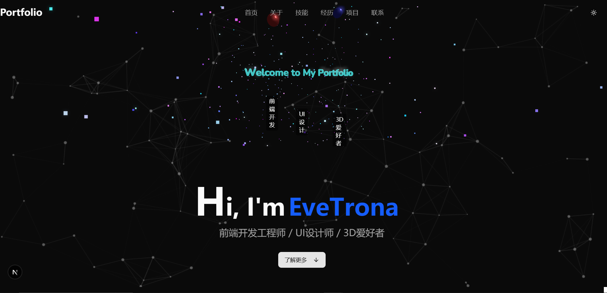
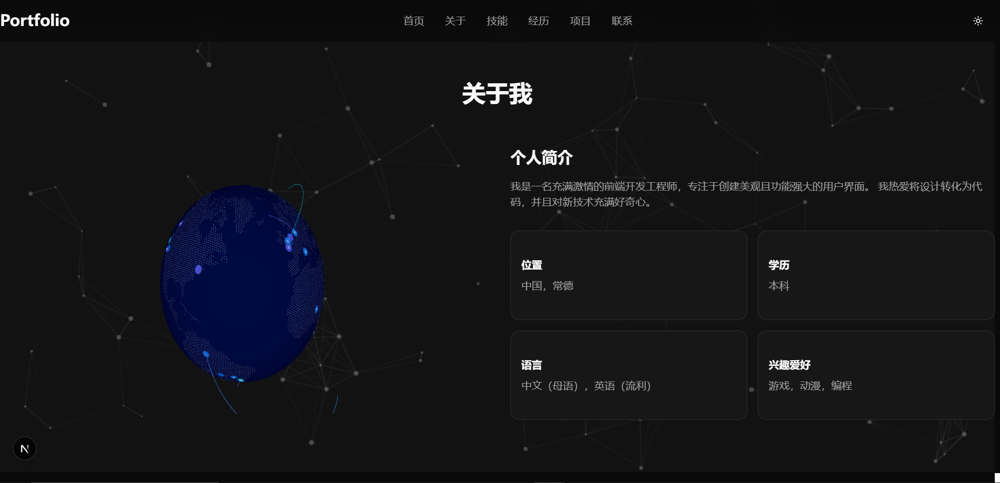
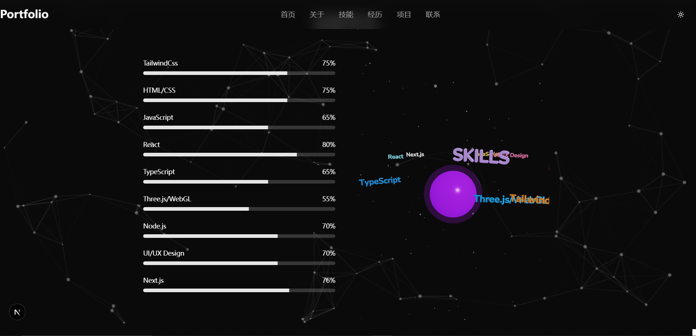

我的项目是一个基于 Next.js 的现代 Web 应用，旨在展示我的技能和作品集，同时提供一个互动性强、视觉效果出色的用户体验。为了实现这个目标，我在技术选型和实现思路上做了以下设计：

1. 框架选择：Next.js 
   我选择了 Next.js 作为项目的核心框架，主要基于以下几点考虑：
    Next.js是基于React框架一种扩展框架，我使用更加熟练，同时也能满足要求，所以选择了Next.js来完成项目
2. UI 组件：Shadcn UI, Aceternity UI
   为了快速构建美观且一致的界面，我引入了Shadcn UI和 Aceternity UI 组件库：
        设计一致性：Shadcn，Aceternity UI 提供了现代化的设计系统和预制组件，比如进度条（Progress）、卡片等，直接适配我的技能展示需求，减少了从零开始写 CSS 的时间。
        自定义能力：它的组件支持高度自定义，我通过 Tailwind CSS 和内联样式（比如动态设置进度条颜色）调整细节，确保与我的品牌风格一致。
        响应式设计：结合 Next.js 的动态布局和Shadcn， Aceternity UI 的响应式支持，我实现了移动端和桌面端的无缝适配，比如通过 useMobile 钩子动态调整 3D 场景的粒子数量。
3. 动画与 3D 效果：Three.js
   为了让项目更具吸引力和互动性，我使用 Three.js 实现了 3D 可视化效果，同时满足要求。

1. 技术挑战与解决方案
    Three.js 与 React 集成：初期遇到 Text 组件的材质错误问题，我通过切换到 Text3D 并调整材质配置解决了兼容性问题。
    动画流畅性：通过降低复杂度和优化 useFrame 的计算逻辑，确保了 60fps 的动画效果。
    字体加载：确保 3D 文本的字体文件（如 Nunito_Bold.json）正确加载到 public 目录，避免渲染异常。
